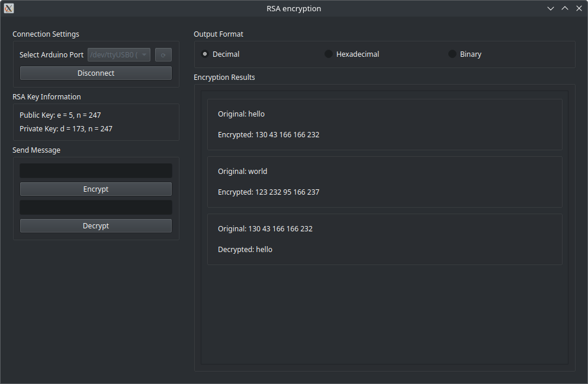

# RSA on Arduino with GUI



### Hardware
- Arduino Uno
- USB cable to connect the Arduino to your computer

### Software
- Arduino IDE (to upload the sketch to the Arduino)
- Python 3.x installed on your system

## Steps to Use the Project

### Load Sketch to Arduino Uno
1. Open the Arduino IDE on your computer.
2. Load the `rsa.ino` file into the Arduino IDE.
   - You can find this file in the project directory.
3. Connect your Arduino Uno to your computer using a USB cable.
4. Select the correct **Board** (`Arduino Uno`) and **Port** from the Arduino IDE.
5. Click the **Upload** button in the Arduino IDE to upload the sketch to the Arduino.

### Start GUI with Python
1. Create a virtual environment:
   ```sh
   python -m venv venv
   ```
2. Activate the virtual environment:
   - On Linux/macOS:
     ```sh
     source venv/bin/activate
     ```
   - On Windows:
     ```sh
     venv\Scripts\activate
     ```
3. Install the required Python packages:
   ```sh
   pip install -r req.txt
   ```
4. Run the GUI application:
   ```sh
   python main.py
   ```

## Notes
- Ensure that the Arduino IDE is installed and properly configured.
- The `req.txt` file should include all the necessary Python libraries for the GUI.
- Test the connection between the Arduino Uno and your computer before starting the GUI.

## License

This project is licensed under the MIT License - see the [LICENSE](LICENSE) file for details.

